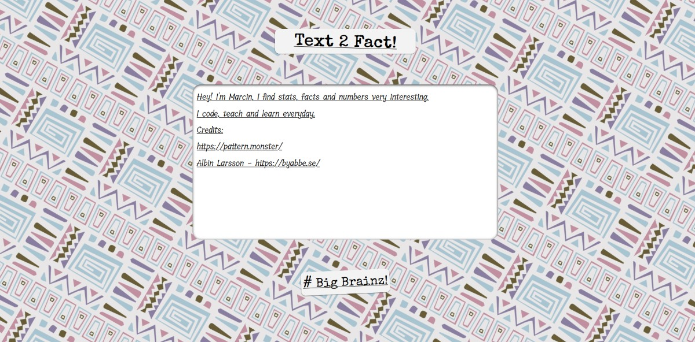

# Text2Fact

## What is it?! 
Simple app taking user input in form of text => converts text to unicode values => does some awesome logic => retrieve fact from wikipedia through API and present to user.

### Tech stack used?
HTML, CSS, on front-end. Node.js, Express.js, EJS, axios on back-end.

### How to install?
1) Install node.js and npm, don't know how? => here: https://docs.npmjs.com/downloading-and-installing-node-js-and-npm
2) Use command npm install to install packages (express.js, axios, EJS)
3) Use command node index.js to run local server. App will be available on localhost:3001 , Edit index.js to change the port.

 
